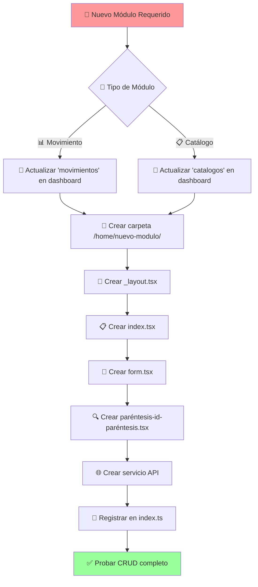
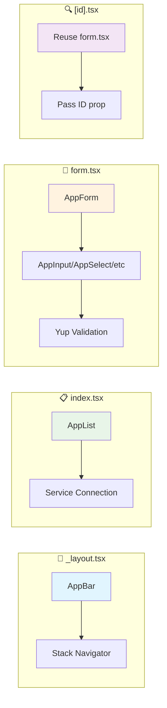
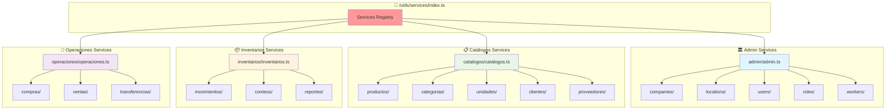
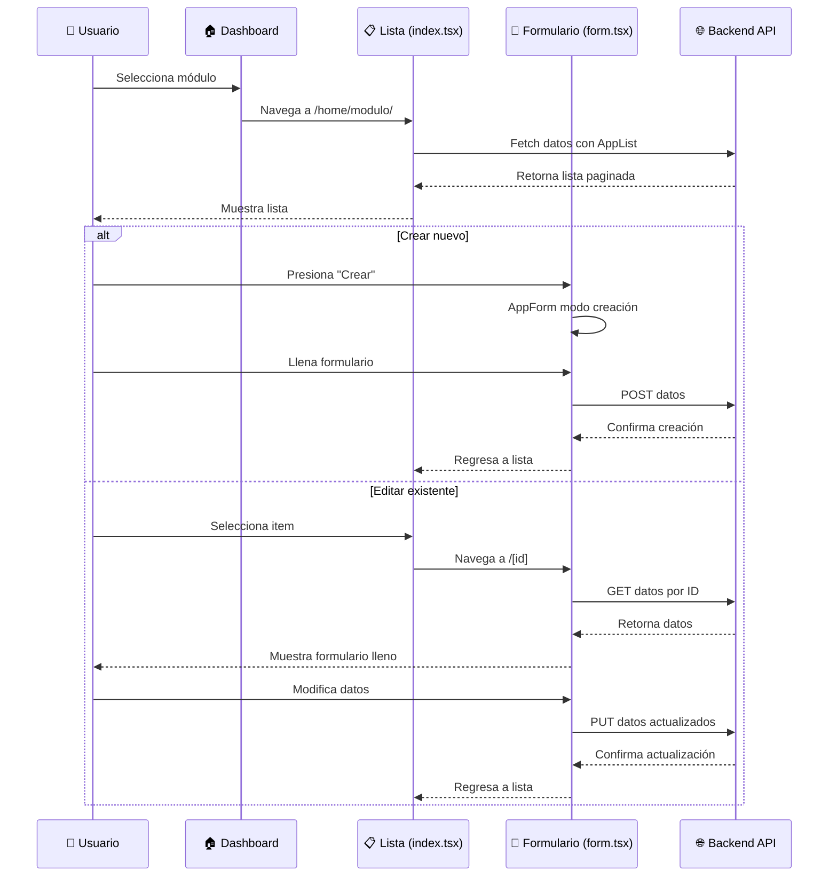
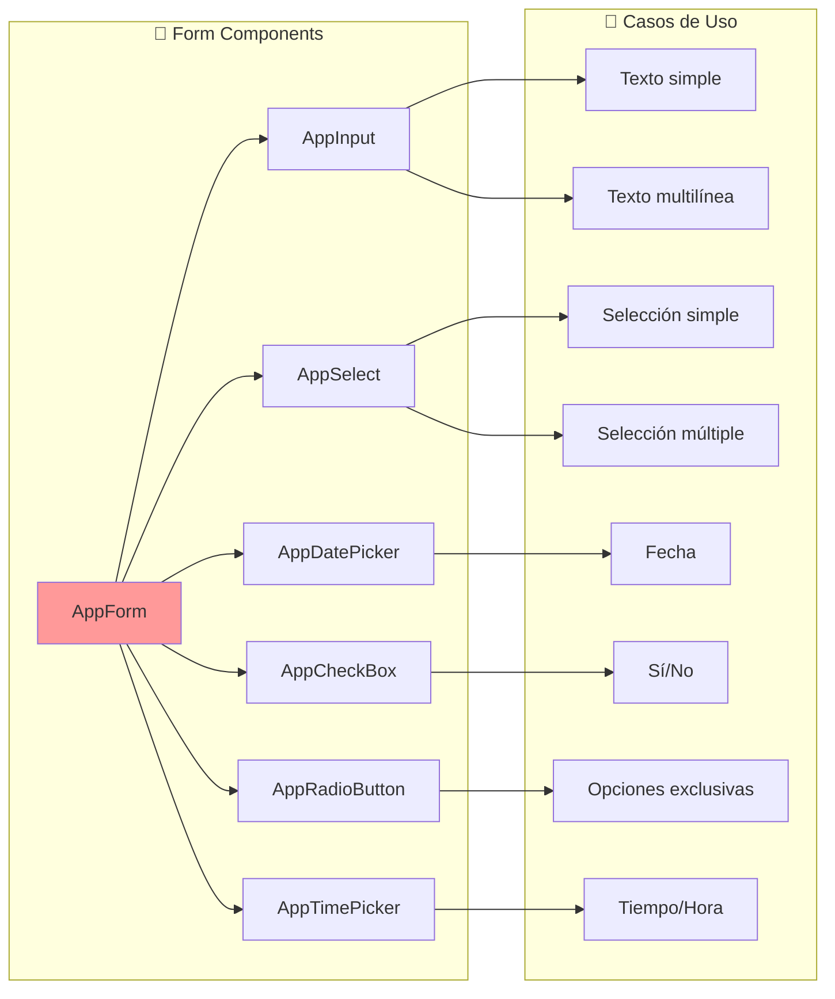
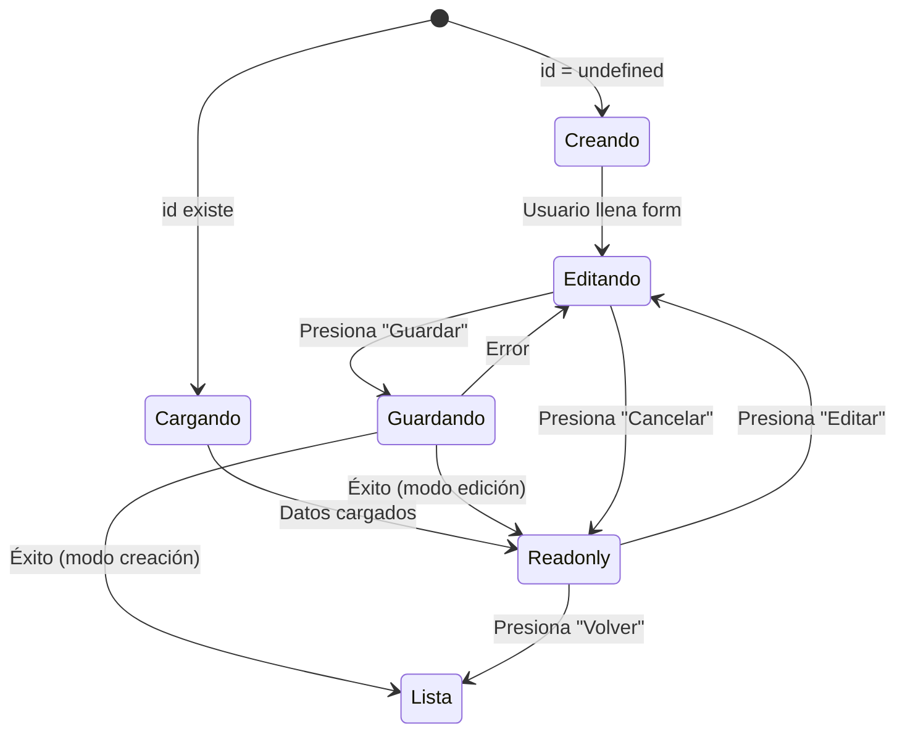

# 🔄 Diagrama de Flujo CRUD - PlastiGest

## 📋 Flujo Completo para Crear un Nuevo Módulo



## 🏗️ Componentes Obligatorios por Archivo



## 🎯 Template Específico por Archivo

### 📄 \_layout.tsx Template

```tsx
// SIEMPRE usar este template
import { AppBar } from "@/components/App/AppBar";
import { Stack } from "expo-router";

export default function [Module]Layout() {
  return (
    <>
      <AppBar title="[Nombre del Módulo]" showBackButton />
      <Stack screenOptions={{ headerShown: false }}>
        <Stack.Screen name="index" />
        <Stack.Screen name="form" />
        <Stack.Screen name="[id]" />
      </Stack>
    </>
  );
}
```

### 📋 index.tsx Template

```tsx
// SIEMPRE usar AppList
import { AppList } from "@/components/App/AppList/AppList";
import Services from "@/utils/services";

export default function [Module]Index() {
  return (
    <AppList
      service={Services.[categoria].[modulo]}
      title="[Título de la Lista]"
      searchPlaceholder="Buscar [elementos]..."
      usePagination={true}
      itemsPerPage={10}
    />
  );
}
```

### 📝 form.tsx Template

```tsx
// SIEMPRE usar AppForm + componentes Form/
import { AppForm } from "@/components/Form/AppForm/AppForm";
import { AppInput } from "@/components/Form/AppInput";
// Importar otros componentes según necesidad
import Services from "@/utils/services";
import * as Yup from "yup";

interface [Module]Data {
  id?: number;
  name: string;
  // ... otros campos
}

const validationSchema = Yup.object().shape({
  name: Yup.string().required("Nombre es requerido"),
  // ... otras validaciones
});

interface Props {
  id?: string;
}

export default function [Module]Form({ id }: Props) {
  return (
    <AppForm<[Module]Data>
      service={Services.[categoria].[modulo]}
      validationSchema={validationSchema}
      initialValues={{
        name: "",
        // ... valores por defecto
      }}
      id={id}
    >
      <AppInput name="name" label="Nombre" />
      {/* Otros componentes Form/ según necesidad */}
    </AppForm>
  );
}
```

### 🔍 [id].tsx Template

```tsx
// SIEMPRE reutilizar form.tsx
import { useLocalSearchParams } from "expo-router";
import [Module]Form from "./form";

export default function [Module]Detail() {
  const { id } = useLocalSearchParams();

  return <[Module]Form id={id as string} />;
}
```

## 🌐 Estructura de Servicios



## 📱 Flujo de Navegación Usuario



## 🎨 Componentes Form/ Disponibles



## 🔄 Estados del AppForm



## 📋 Checklist Detallado

### ✅ Dashboard Updated

```
□ Link agregado en movimientos[] o catalogos[]
□ Ruta correcta: /(tabs)/home/[modulo]
□ Ícono y descripción agregados
□ Colores de palette.ts usados
```

### ✅ Module Structure

```
□ Carpeta /home/[modulo]/ creada
□ _layout.tsx implementado con AppBar
□ index.tsx implementado con AppList
□ form.tsx implementado con AppForm
□ [id].tsx implementado reutilizando form
```

### ✅ Service Integration

```
□ Servicio creado en utils/services/[categoria]/
□ Interface TypeScript definida
□ CrudService configurado con baseURL
□ Registrado en [categoria]/[categoria].ts
□ Registrado en services/index.ts
```

### ✅ Form Components

```
□ AppForm usado como wrapper principal
□ AppInput para campos de texto
□ AppSelect para selecciones
□ AppDatePicker para fechas
□ AppCheckBox para booleanos
□ Validación Yup implementada
```

### ✅ Testing

```
□ Navegación funciona desde dashboard
□ Lista carga correctamente con AppList
□ Formulario crea nuevos registros
□ Formulario edita registros existentes
□ Validaciones funcionan
□ Navegación entre pantallas fluida
```

Este flujo garantiza que cada módulo siga exactamente el mismo patrón establecido en el sistema PlastiGest.
