# Arquitectura General del Sistema Plastigest

> Diagrama completo de la arquitectura del sistema, incluyendo frontend, backend e integraciones
> 
> **Fecha de actualización**: Diciembre 12, 2025

## Índice

1. [Visión General](#visión-general)
2. [Arquitectura de Alto Nivel](#arquitectura-de-alto-nivel)
3. [Stack Tecnológico](#stack-tecnológico)
4. [Componentes del Sistema](#componentes-del-sistema)
5. [Flujos de Datos](#flujos-de-datos)
6. [Integraciones Externas](#integraciones-externas)
7. [Flujos de Procesos de Negocio](#flujos-de-procesos-de-negocio)
8. [Seguridad y Autenticación](#seguridad-y-autenticación)

---

## Visión General

Plastigest es un sistema de gestión empresarial (ERP) completo que abarca:
- **Inventario**: Control de stock en tiempo real
- **Ventas**: Punto de venta (POS) y gestión de ventas
- **Compras**: Órdenes de compra a proveedores
- **Producción**: Manufactura y control de fórmulas
- **Transferencias**: Movimientos entre ubicaciones
- **Reportes**: Análisis y dashboard de negocio
- **Administración**: Multi-empresa, multi-ubicación

---

## Arquitectura de Alto Nivel

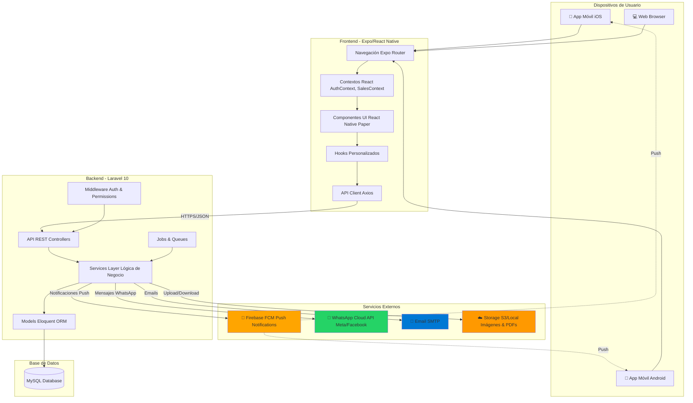

---

## Stack Tecnológico

### Frontend (Mobile & Web)

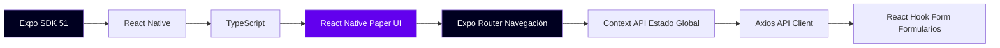

#### Bibliotecas Principales
- **Expo SDK 51**: Framework para React Native
- **React Native**: Framework de UI
- **TypeScript**: Tipado estático
- **React Native Paper**: Biblioteca de componentes Material Design
- **Expo Router**: Navegación basada en archivos
- **Axios**: Cliente HTTP
- **React Hook Form**: Gestión de formularios
- **React Query** (opcional): Cache de datos
- **Firebase SDK**: Notificaciones push
- **Expo Image Picker**: Selección de imágenes
- **Expo Camera**: Escaneo de códigos de barras

### Backend (API)

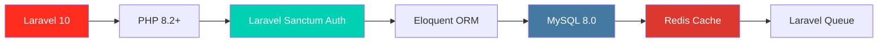

#### Paquetes Principales
- **Laravel 10**: Framework PHP
- **Laravel Sanctum**: Autenticación API
- **Eloquent ORM**: Mapeo objeto-relacional
- **Spatie Laravel Permission**: Roles y permisos
- **Kreait Firebase PHP**: Integración Firebase
- **Netflie WhatsApp API**: Integración WhatsApp
- **Laravel Excel**: Exportación de datos
- **Barryvdh DomPDF**: Generación de PDFs
- **Laravel Telescope**: Debugging y monitoreo

### Infraestructura

- **Servidor Web**: Nginx / Apache
- **Base de Datos**: MySQL 8.0
- **Cache**: Redis
- **Storage**: Local / AWS S3
- **SSL/TLS**: Let's Encrypt
- **Deployment**: Docker (opcional)

---

## Componentes del Sistema

### 1. Frontend Mobile/Web

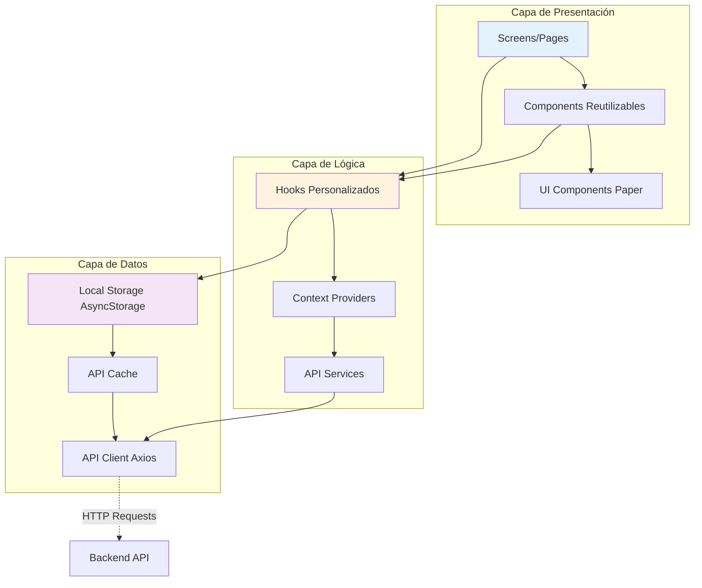

#### Estructura de Navegación

```mermaid
graph TD
    A[Root _layout.tsx] --> B{Usuario Autenticado?}
    B -->|No| C[/login]
    B -->|Sí| D{Empresa Seleccionada?}
    D -->|No| E[/stacks/selectCompany]
    D -->|Sí| F{Ubicación Seleccionada?}
    F -->|No| G[LocationSelector Modal]
    F -->|Sí| H[/tabs Navegación Principal]
    
    H --> I[Tab: Home]
    H --> J[Tab: Inventory]
    H --> K[Tab: Reports]
    H --> L[Tab: Administration]
    H --> M[Tab: Profile]
    
    style C fill:#FF5252,color:#fff
    style E fill:#FFC107
    style G fill:#FFC107
    style H fill:#4CAF50,color:#fff
```

---

### 2. Backend API

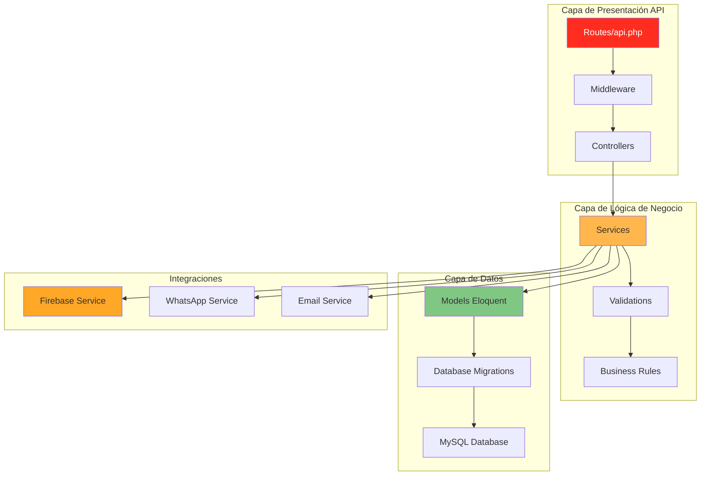

#### Flujo de Petición HTTP

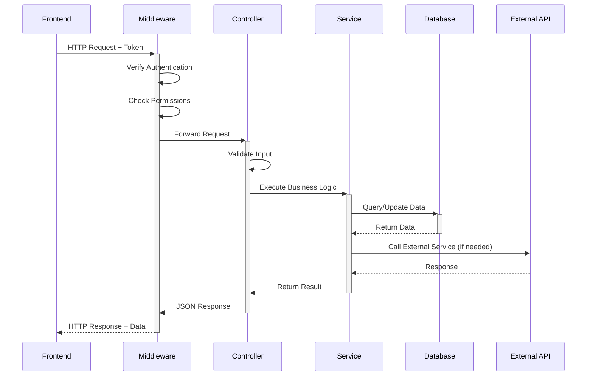

---

## Flujos de Datos

### Flujo de Autenticación

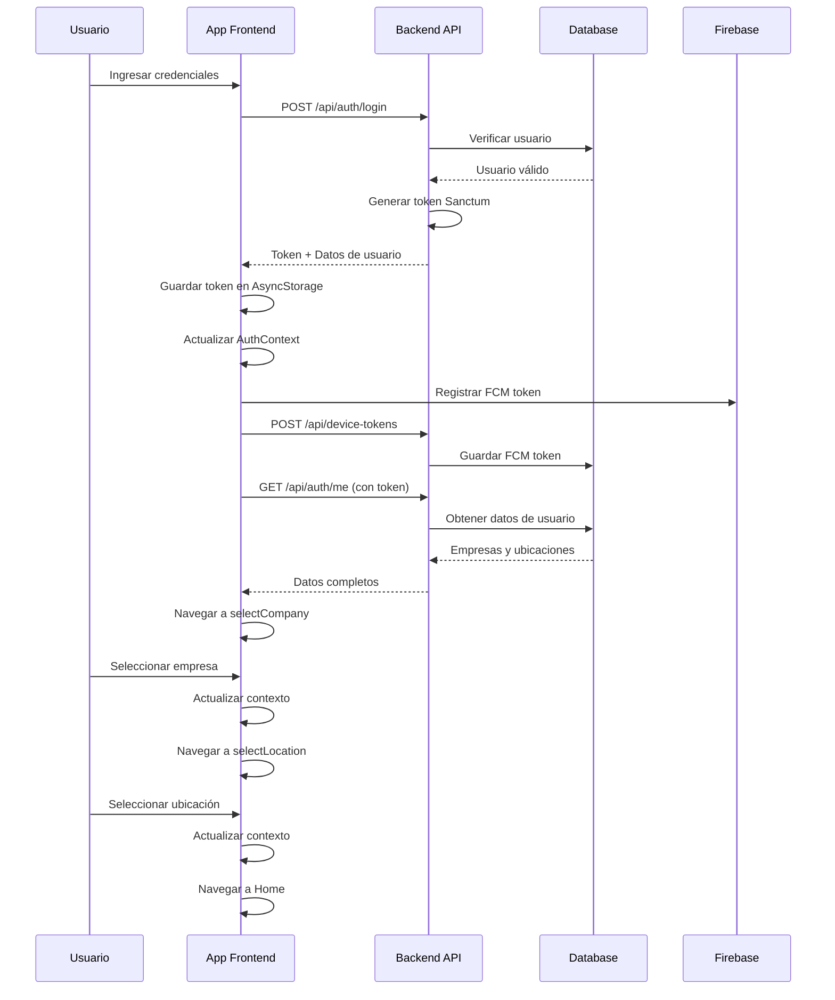

---

### Flujo de Compra con WhatsApp

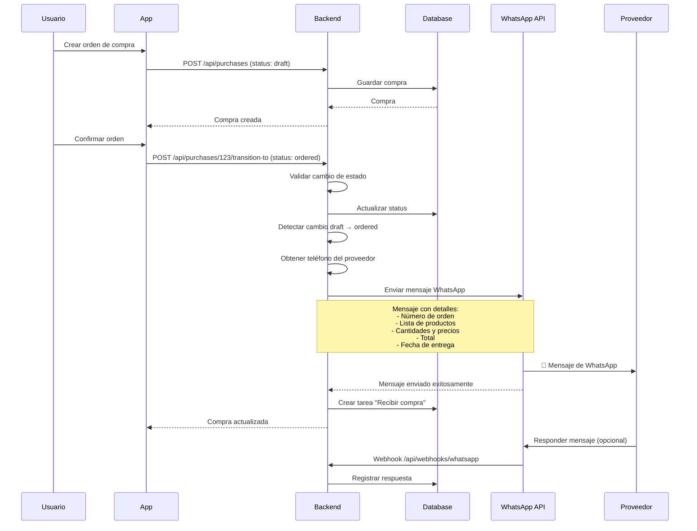

---

### Flujo de Notificación Push por Stock Bajo

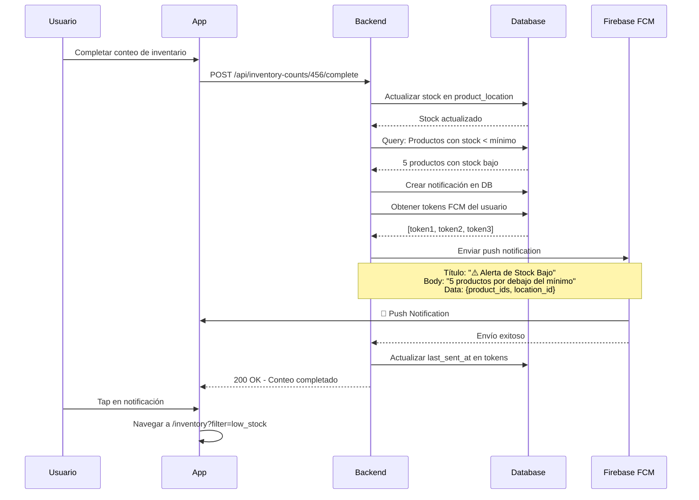

---

### Flujo de Transferencia entre Ubicaciones

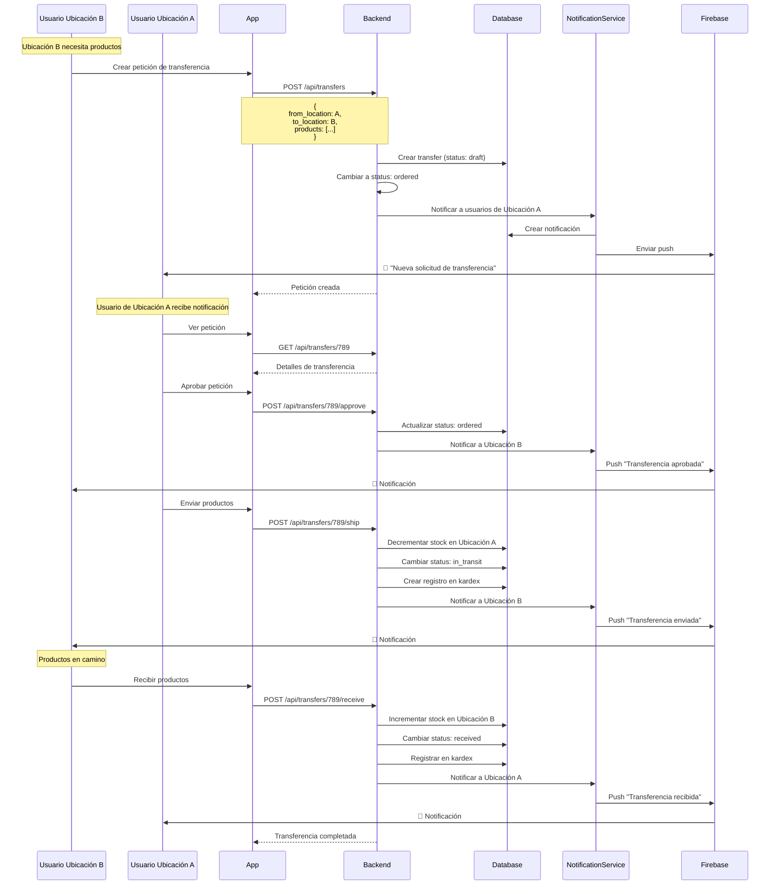

---

## Integraciones Externas

### 1. Firebase Cloud Messaging (FCM)

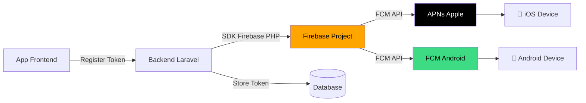

**Flujo**:
1. App se registra y obtiene FCM token
2. App envía token al backend
3. Backend almacena token en tabla `device_tokens`
4. Cuando hay evento, backend usa Firebase SDK
5. Firebase enruta a APNs (iOS) o FCM (Android)
6. Dispositivo recibe notificación

**Eventos que generan notificaciones**:
- Stock bajo en inventario
- Tarea asignada
- Tarea próxima a vencer
- Transferencia recibida
- Compra pendiente de recibir

---

### 2. WhatsApp Cloud API (Meta)

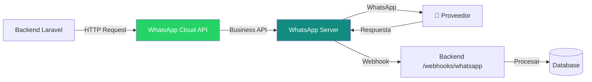

**Configuración**:
- App ID en Meta Developer Console
- Phone Number ID
- Access Token
- Webhook URL: `https://api.plastigest.com/api/webhooks/whatsapp`
- Verify Token: `plastigest_webhook_token_2024`

**Uso**:
- Envío de órdenes de compra a proveedores
- Confirmaciones automáticas
- Recepción de respuestas (webhook)

---

### 3. Storage de Archivos

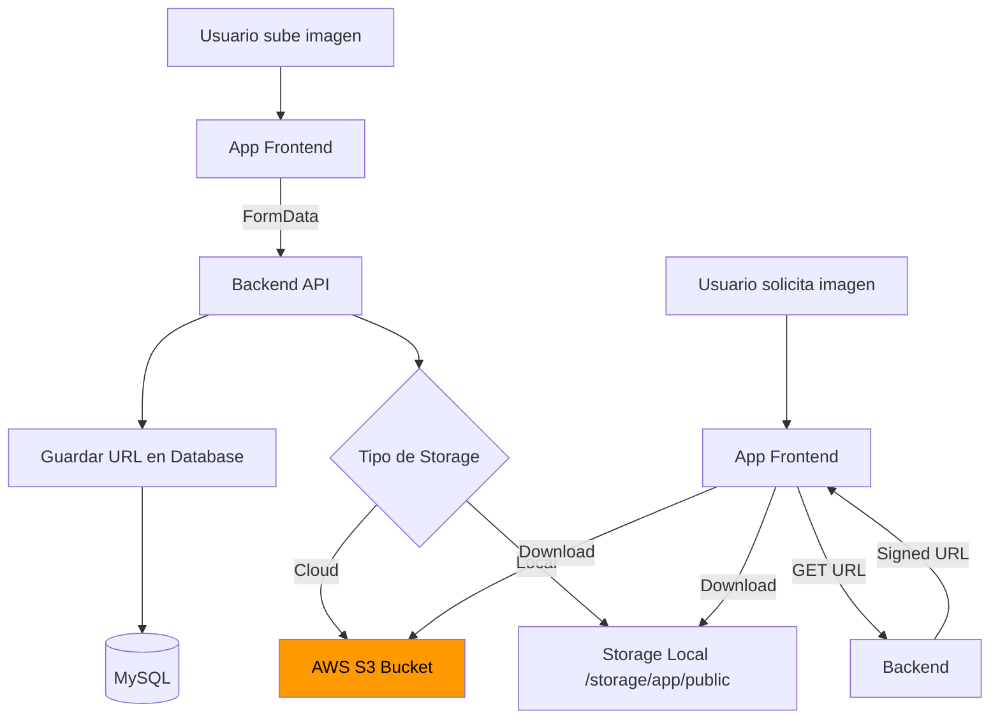

**Tipos de archivos**:
- Imágenes de productos
- PDFs de reportes
- Códigos de barras
- Logos de empresas
- Documentos de compras/ventas

---

## Flujos de Procesos de Negocio

### Proceso de Venta Completo

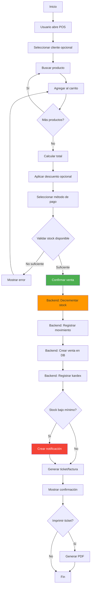

---

### Proceso de Compra a Proveedor

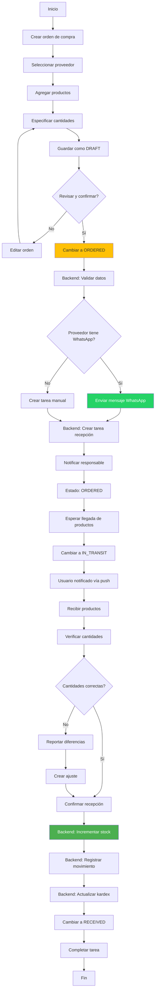

---

### Proceso de Conteo de Inventario

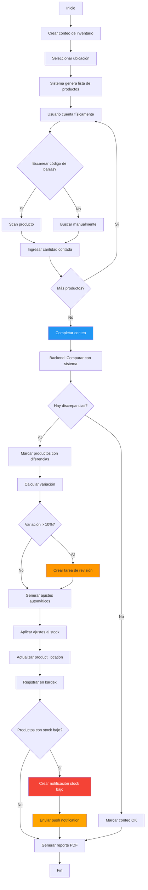

---

## Seguridad y Autenticación

### Sistema de Autenticación

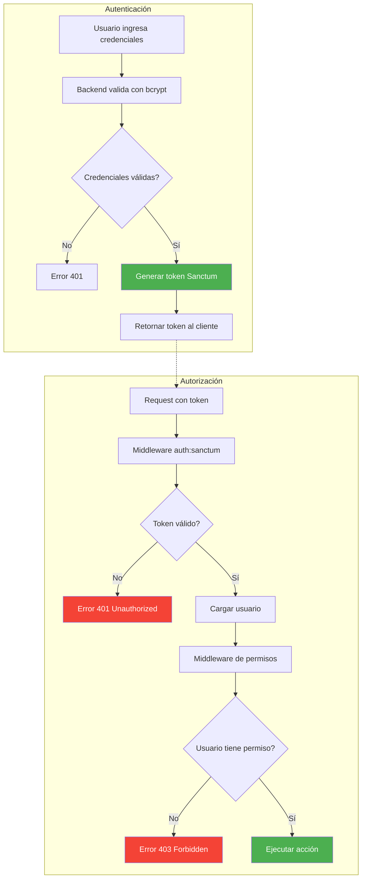

---

### Modelo de Permisos

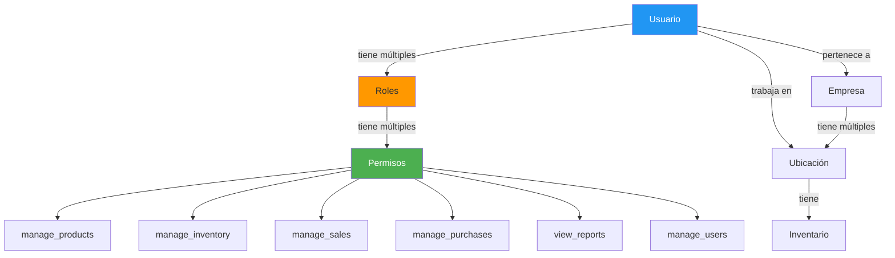

**Roles comunes**:
- **Super Admin**: Control total del sistema
- **Administrador de Empresa**: Gestiona su empresa
- **Gerente de Sucursal**: Gestiona su ubicación
- **Vendedor**: Solo ventas y consultas
- **Almacenista**: Inventario y recepciones
- **Operador**: Operaciones básicas

---

### Contexto Multi-Empresa y Multi-Ubicación

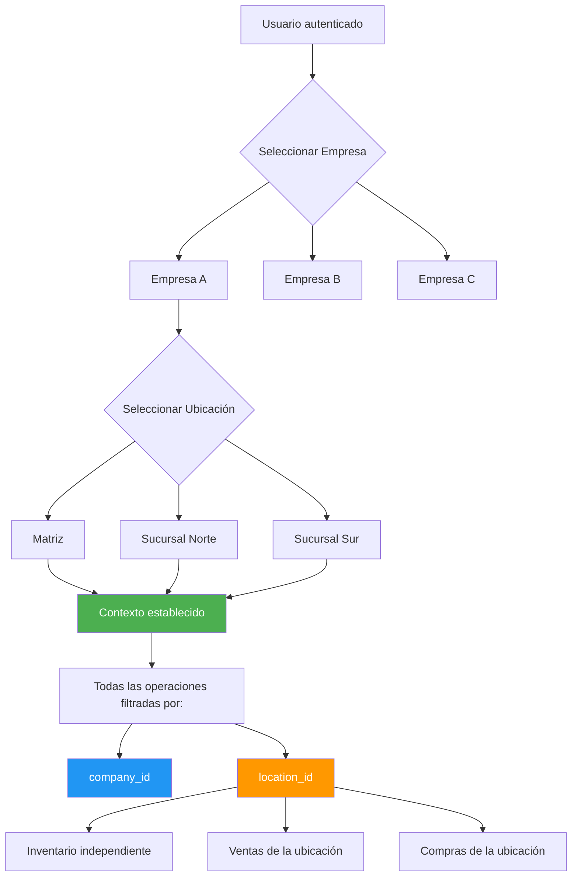

**Helpers en Backend**:
```php
CurrentCompany::get()  // Empresa actual del usuario
CurrentLocation::get() // Ubicación actual del usuario
```

**Contextos en Frontend**:
```typescript
const { selectedCompany, location } = useAuth()
```

---

## Diagrama de Despliegue

```mermaid
graph TB
    subgraph "Cliente"
        A[📱 iOS App]
        B[📱 Android App]
        C[💻 Web Browser]
    end
    
    subgraph "CDN / App Stores"
        D[App Store]
        E[Google Play]
        F[Expo OTA Updates]
    end
    
    subgraph "Servidor Web"
        G[Nginx/Apache]
        G --> H[Laravel API]
        H --> I[PHP-FPM]
    end
    
    subgraph "Servicios"
        J[(MySQL 8.0)]
        K[(Redis Cache)]
        L[Queue Worker]
    end
    
    subgraph "Cloud Services"
        M[Firebase FCM]
        N[WhatsApp API]
        O[AWS S3 opcional]
    end
    
    A --> D
    B --> E
    A --> F
    B --> F
    
    A -->|HTTPS| G
    B -->|HTTPS| G
    C -->|HTTPS| G
    
    H --> J
    H --> K
    H --> L
    
    H --> M
    H --> N
    H --> O
    
    style G fill:#009688,color:#fff
    style J fill:#4479A1,color:#fff
    style K fill:#DC382D,color:#fff
    style M fill:#FFA500
    style N fill:#25D366,color:#fff
```

---

## Resumen de Comunicación entre Componentes

### Frontend → Backend

**Métodos de comunicación**:
- HTTP/HTTPS requests (REST API)
- JSON como formato de datos
- Autenticación: Bearer Token (Sanctum)
- Headers: `Authorization: Bearer {token}`

**Tipos de peticiones**:
```
GET    /api/products         → Listar
POST   /api/products         → Crear
GET    /api/products/{id}    → Detalle
PUT    /api/products/{id}    → Actualizar
DELETE /api/products/{id}    → Eliminar
```

---

### Backend → Servicios Externos

#### Firebase FCM
- **Protocolo**: HTTPS
- **Autenticación**: Service Account JSON
- **Uso**: Envío de push notifications

#### WhatsApp Cloud API
- **Protocolo**: HTTPS
- **Autenticación**: Bearer Token (Meta)
- **Uso**: Envío de mensajes a proveedores
- **Webhook**: Recepción de respuestas

#### Email SMTP
- **Protocolo**: SMTP/TLS
- **Autenticación**: Usuario/Contraseña
- **Uso**: Notificaciones por email (opcional)

---

### Backend → Base de Datos

- **Conexión**: PDO MySQL
- **ORM**: Eloquent
- **Migrations**: Control de versiones de esquema
- **Transactions**: Garantía de integridad en operaciones críticas

---

## Escalabilidad y Performance

### Estrategias de Optimización

```mermaid
graph LR
    A[Request] --> B[Redis Cache]
    B -->|Cache Hit| C[Return Cached]
    B -->|Cache Miss| D[Query Database]
    D --> E[Store in Cache]
    E --> C
    
    F[Queue Jobs] --> G[Background Processing]
    G --> H[Send Emails]
    G --> I[Generate PDFs]
    G --> J[Process Images]
    
    style B fill:#DC382D,color:#fff
    style G fill:#FF9800
```

**Técnicas**:
1. **Cache de consultas frecuentes** (Redis)
   - Catálogos (categorías, unidades)
   - Datos de usuario
   - Configuraciones

2. **Lazy Loading de relaciones** (Eloquent)
   - Cargar relaciones solo cuando se necesitan
   - Evitar N+1 queries

3. **Paginación**
   - Todas las listas paginadas
   - Límite de 50-100 items por página

4. **Queue Jobs**
   - Procesamiento en background
   - Envío de emails
   - Generación de PDFs
   - Procesamiento de imágenes

5. **Índices en base de datos**
   - Índices en columnas de búsqueda frecuente
   - Índices compuestos para filtros comunes

---

## Monitoreo y Logging

```mermaid
graph TD
    A[Aplicación] --> B[Laravel Telescope]
    A --> C[Log Files]
    A --> D[Error Tracking Sentry]
    
    B --> E[HTTP Requests]
    B --> F[Database Queries]
    B --> G[Cache Operations]
    B --> H[Queue Jobs]
    
    C --> I[Application Log]
    C --> J[Error Log]
    C --> K[Access Log]
    
    style B fill:#4951C9,color:#fff
    style D fill:#362D59,color:#fff
```

**Herramientas**:
- **Laravel Telescope**: Debug y monitoreo en desarrollo
- **Logs**: Registro de errores y eventos
- **Sentry** (opcional): Tracking de errores en producción
- **New Relic** (opcional): Monitoreo de performance

---

## Backup y Recuperación

```mermaid
graph LR
    A[MySQL Database] -->|Backup Diario| B[Dump SQL]
    B --> C[Compresión gzip]
    C --> D[Storage Local]
    C --> E[S3 Bucket]
    
    F[Storage Files] -->|Sync| E
    
    G[Redis Cache] -.->|Opcional| H[Persistencia RDB]
    
    style A fill:#4479A1,color:#fff
    style E fill:#FF9900,color:#000
```

**Estrategia**:
- Backup diario automático de base de datos
- Retención: 7 días locales, 30 días en cloud
- Backup de archivos: sincronización a S3
- Scripts de restauración documentados

---

## Documentos Relacionados

Para más información detallada sobre cada componente:

### Frontend
- [RESUMEN_MODULOS.md](RESUMEN_MODULOS.md) - Módulos del frontend
- [NAVEGACION.md](NAVEGACION.md) - Sistema de navegación

### Backend
- [RESUMEN_MODULOS_BACKEND.md](/home/cyag/plastigest/back/plastigest-back/docs/new/RESUMEN_MODULOS_BACKEND.md) - Módulos del backend

### Documentación Técnica Backend
- TASKS_AND_NOTIFICATIONS_SYSTEM.md
- PUSH_NOTIFICATIONS_LOW_STOCK.md
- WHATSAPP_WEBHOOK_SETUP.md
- INVENTORY_SYSTEM_DOCUMENTATION.md
- TRANSFER_REQUISITION_FLOW.md

---

## Glosario de Términos

- **ERP**: Enterprise Resource Planning
- **FCM**: Firebase Cloud Messaging
- **ORM**: Object-Relational Mapping
- **CRUD**: Create, Read, Update, Delete
- **API**: Application Programming Interface
- **REST**: Representational State Transfer
- **JSON**: JavaScript Object Notation
- **JWT**: JSON Web Token
- **Sanctum**: Sistema de autenticación de Laravel
- **Eloquent**: ORM de Laravel
- **Expo**: Framework para React Native
- **OTA**: Over-The-Air (actualizaciones sin app store)

---

*Última actualización: Diciembre 12, 2025*
